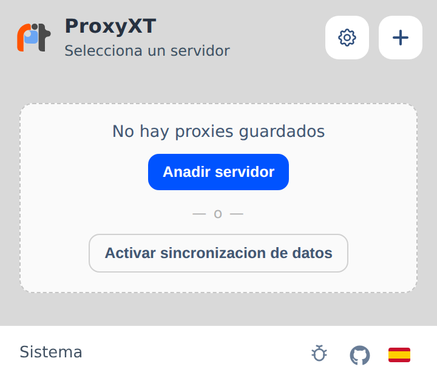
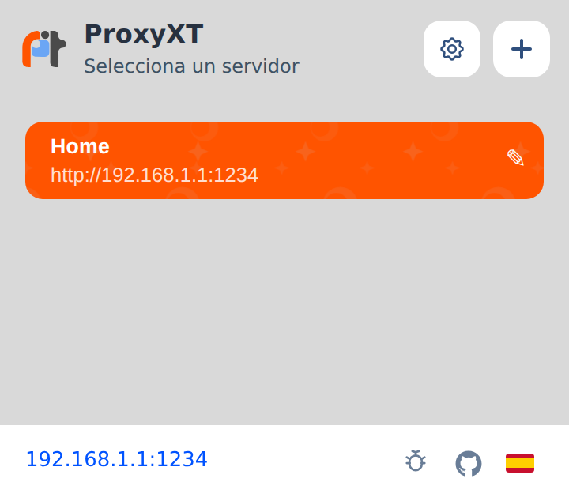
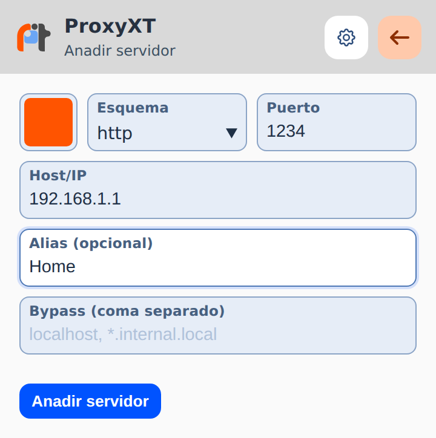
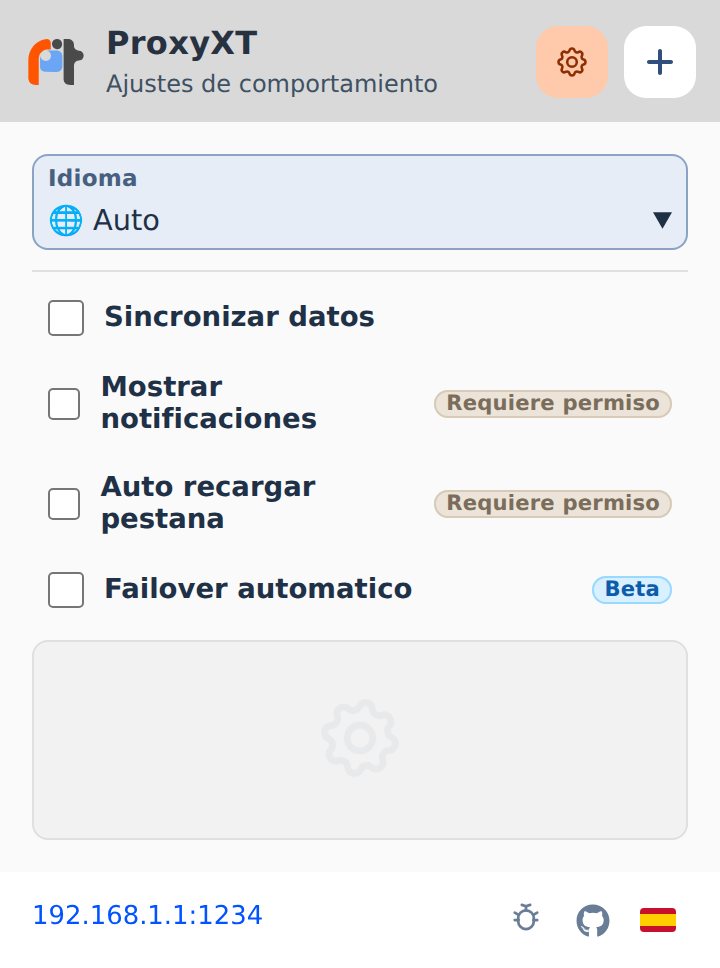
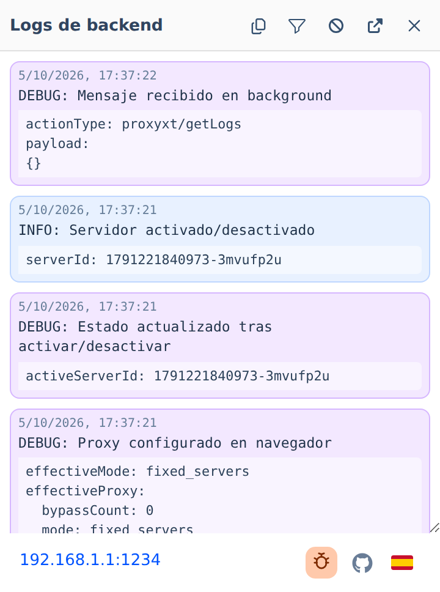

# ProxyXT

Extension WebExtension para gestionar varios servidores proxy desde un popup ligero, con cambio rapido, logs de backend y preferencias de comportamiento.

## Caracteristicas

- Alta, edicion y eliminacion de servidores proxy.
- Color personalizable por servidor, con paleta predefinida y colores propios.
- Reordenacion de servidores arrastrando las filas.
- Activacion y desactivacion rapida del servidor activo.
- Failover automatico round-robin ante errores de proxy.
- Recarga opcional de la pestana activa al activar o desactivar un servidor.
- Sincronizacion opcional de servidores con la cuenta del navegador mediante `storage.sync`.
- Notificaciones opcionales de la extension (por ejemplo, avisos de failover).
- Logs internos del backend accesibles desde el popup, con filtros por nivel, copia al portapapeles y apertura en ventana aparte.
- Interfaz multilenguaje con soporte para en, es, fr, pt, it y de.
- Deteccion automatica de idioma del navegador.

## Capturas

Capturas del popup renderizado en Chromium (360 px de ancho).

### Vista principal



### Servidor activo



### Alta de servidor



### Preferencias



### Logs del backend



## Stack

- Preact
- esbuild
- js-yaml
- WebExtensions API

## Requisitos

- Node.js 18 o superior recomendado.
- Un navegador compatible con WebExtensions.

## Instalacion

```bash
npm install
```

## Desarrollo y build

Genera la extension empaquetada en la carpeta `dist`:

```bash
npm run build
```

Builds especificos por navegador (salida en `build/chrome` y `build/firefox`):

```bash
npm run build:chrome
npm run build:firefox
```

El build de Chrome omite `browser_specific_settings` y el de Firefox usa `background.scripts` en lugar de `background.service_worker`.

## Tests

```bash
npm test
```

## Capturas del README

Las capturas de `static/` se generan con Playwright cargando el build de Chrome en Chromium:

```bash
npx playwright install chromium   # solo la primera vez
npm run screenshots
```

El script (`scripts/screenshots.mjs`) compila `build/chrome`, abre el popup a 360 px de ancho, da de alta un servidor de ejemplo y captura la vista principal, el alta de servidor, el servidor activo, las preferencias y los logs. Variables opcionales:

- `CHROMIUM_PATH`: ejecutable de Chromium a usar en lugar del instalado por Playwright.
- `SCREENSHOTS_OUT`: carpeta de salida (por defecto `static/`).

## CI y releases

- `.github/workflows/build.yml`: en cada push a `main` y en cada pull request ejecuta los tests y genera los zip para Chrome y Firefox como artefactos.
- `.github/workflows/release.yml`: ejecucion manual desde la pestana Actions. Pide el tipo de incremento (`major`, `minor` o `patch`), sube la version en `package.json`, `package-lock.json` y `src/manifest.yml`, crea el commit y el tag `vX.Y.Z`, ejecuta el build y publica una GitHub Release con los zip de Chrome y Firefox adjuntos.

## Cargar la extension

### Chrome / Chromium

1. Abre `chrome://extensions`.
2. Activa el modo desarrollador.
3. Pulsa en Load unpacked.
4. Selecciona la carpeta `dist`.

### Firefox

1. Abre `about:debugging#/runtime/this-firefox`.
2. Pulsa en Load Temporary Add-on....
3. Selecciona el archivo `manifest.json` dentro de `dist`.

## Permisos usados

- `storage`: persistencia local y sincronizacion opcional.
- `proxy`: aplicacion de configuracion proxy del navegador.
- `tabs` como permiso opcional: se solicita solo si el usuario activa la recarga de la pestana activa.
- `notifications` como permiso opcional: se solicita solo si el usuario activa las notificaciones de la extension.

## Estructura

```text
messages/    Diccionarios YAML de traduccion
scripts/     Build con esbuild, comprobacion de claves de traduccion y capturas
src/         Popup, background, manifest y recursos fuente
static/      Capturas usadas en este README
dist/        Extension generada lista para cargar en el navegador
build/       Builds especificos por navegador (chrome, firefox)
```

## Preferencias disponibles

- Idioma manual o automatico.
- Sincronizar servidores con la cuenta del navegador.
- Mostrar notificaciones de la extension.
- Recargar pestana activa al cambiar el estado del proxy.
- Failover automatico round-robin (beta).

## Notas

- Si no hay servidor activo, la extension deja el navegador en modo sistema.
- La sincronizacion depende de que el navegador soporte `storage.sync` y de la sesion del usuario.
- Los logs del backend ayudan a diagnosticar errores de aplicacion del proxy o de sincronizacion.